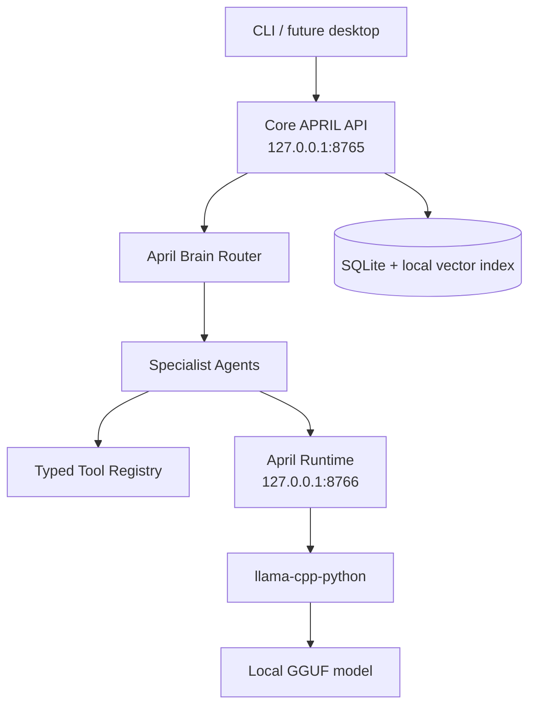

# APRIL

APRIL is a private, local-first AI assistant MVP for macOS. It is CLI-first, uses a separate local model service called April Runtime, supports specialist agents, stores inspectable local memory, and enforces deterministic tool permissions with exact-action approvals.

No model files are downloaded automatically. No cloud AI APIs, Ollama integration, telemetry, or unrestricted shell execution are included.

## Architecture



Only `services/april_runtime/llama_cpp_backend.py` imports `llama_cpp`. Agents and the core API talk to models through HTTP requests to April Runtime.

## Install

```bash
python3.11 -m venv .venv
.venv/bin/pip install -e '.[dev]'
```

Or:

```bash
make install-dev
```

## Configuration

Defaults live in `configs/april.yaml` and `configs/models.yaml`. Environment overrides use the `APRIL_` prefix.

Useful local development settings:

```bash
export APRIL_RUNTIME_BACKEND=fake
export APRIL_API_TOKEN=local-dev-token
export APRIL_ALLOWED_FILESYSTEM_ROOTS="$PWD"
```

Both APIs bind to `127.0.0.1` by default. CORS is disabled by default.

## Local Models

Place GGUF files manually under `models/` using the names configured in `configs/models.yaml`:

- `models/granite3.3-2b-q4_k_m.gguf`
- `models/qwen3-1.7b-q8_0.gguf`
- `models/qwen3-0.6b-q8_0.gguf`

Missing files do not crash startup. Runtime health reports degraded status. Use `APRIL_RUNTIME_BACKEND=fake` for tests and development without model files.

## Start Services

Terminal 1:

```bash
make run-runtime
```

Terminal 2:

```bash
make run-api
```

CLI:

```bash
make cli
april health
april ask "April, plan my work today."
april models
```

## Run APRIL From Any Folder

Recommended zsh setup:

```bash
cd april
scripts/setup_mac.sh --base --global --add-to-path
source ~/.zshrc
run april --fake
```

Alternative without modifying shell config:

```bash
cd april
scripts/setup_mac.sh --base
make install-global
export PATH="$HOME/.local/bin:$PATH"
run april --fake
```

Fallback that always works after install, even before PATH reload:

```bash
"$HOME/.local/bin/run" april --fake
```

`run april` locates `APRIL_HOME`, starts April Runtime and the Core API when
they are missing, waits for both localhost health checks, then opens interactive
CLI chat. It does not start voice, wake-word, or microphone services. Services
still bind to `127.0.0.1`. Real GGUF models are optional for MVP testing; use
`--fake` to run with the fake backend.

Useful launcher commands:

```bash
run april --fake
april-run doctor
run april doctor
run april config validate
run april verify --fake
run april status
run april stop
run april restart
run april logs
run april ask "April, plan my work today."
run april health
run april models
run april approvals
run april approve APPROVAL_ID
run april deny APPROVAL_ID
```

`run april --fake` starts missing services with `APRIL_RUNTIME_BACKEND=fake`
without editing `.env`. Services still bind to `127.0.0.1`; PID files are under
`data/run/`, and logs are written to `logs/runtime.log` and `logs/api.log`.

Uninstall only APRIL-owned wrappers:

```bash
make uninstall-global
```

Troubleshooting `zsh: command not found: run`:

Cause: the APRIL wrapper is not installed or `~/.local/bin` is not in PATH.

Temporary fix for the current shell:

```bash
cd april
make install-global
export PATH="$HOME/.local/bin:$PATH"
run april --fake
```

Permanent zsh fix:

```bash
cd april
make install-global-path
source ~/.zshrc
run april --fake
```

If `run` resolves to a different command, inspect with:

```bash
april-run doctor
```

Then force-replace only when you intend to replace the existing `run` command:

```bash
make install-global-force
```

## Approval Example

```bash
april ask "Apply the fix." --project-id PROJECT_ID
april approvals
april approve APPROVAL_ID
```

APRIL never treats a casual "yes" inside chat as approval. Approval must reference the exact approval ID or use the dedicated CLI/API approval flow. Before an approved tool runs, APRIL reloads the approval, revalidates current tool policy for the scoped agent, verifies the exact argument hash, records the tool call, consumes the approval once, and audits the outcome.

For natural chat code changes such as `april ask "Apply the fix." --project-id
PROJECT_ID`, APRIL asks the coding model for a unified diff only, validates that
the patch is scoped to the selected project, saves it as a safe draft patch, and
creates a Level 3 approval for applying that exact patch once.

Patch proposals are stored in APRIL's content-addressed artifact store under
`data/artifacts/patches/`. The artifact may live outside the selected
repository, but every patch target must still resolve inside the selected
project. Patch approvals bind the artifact ID, patch SHA-256, exact byte length,
affected paths, selected project ID, repository root, available Git state,
expected side effects, expiry, and approval ID. Before applying, APRIL loads the
approved immutable bytes, recalculates the digest, validates target paths again,
then runs `git -C REPO apply --check -` and `git -C REPO apply -` against those
same in-memory bytes. Git commit approvals bind the exact staged diff digest,
staged tree ID, commit message, and repository identity.

## Repository Analysis Example

```bash
export APRIL_ALLOWED_FILESYSTEM_ROOTS="$PWD"
april project add "$PWD"
april ask "April, check why the animation in this repository is broken." --project-id PROJECT_ID
```

Repository work requires an explicit selected project through `project_id` or `repo_path`; APRIL no longer guesses a repository from the first allowed root. The coding agent can use read-only Git and filesystem tools without approval. File edits, patch application, test execution, and commits require approval.

When a project is selected, APRIL derives project-scoped tool roots from trusted
application state. Model-provided repository roots or absolute file paths cannot
override the selected project.

## Streaming

`POST /chat/stream` uses real runtime streaming. The Core API routes the request, runs permitted tools, stops immediately for approvals, and then forwards token events from April Runtime without buffering the full response. SSE events include `meta`, `token`, `approval_required`, `usage`, `done`, and `error`.

## Conversations

`POST /chat` accepts an optional `conversation_id`. If omitted, APRIL creates a
local conversation and returns its ID in `result.conversation_id`. The
interactive CLI creates one conversation ID per chat session and reuses it for
every turn. Recent bounded history is included in the next agent prompt as
context, not instructions.

## Memory

Memory is local SQLite plus a local vector index:

```bash
april memory search "project preference"
april memory delete MEMORY_ID
april memory export
april conversation delete CONVERSATION_ID
```

Durable memory is not created automatically from every message. Sensitive-looking content is rejected by policy.

When the brain supplies `memory_queries`, APRIL retrieves local memories by policy and includes them in the agent prompt under a clearly marked context section. General planning requests also receive a small set of recent durable memories. Coding requests with a selected indexed project retrieve project-scoped vector chunks with local citations.

## Voice

Voice is optional and disabled by default. Configure local `whisper.cpp` and Piper paths in `configs/april.yaml` or environment variables. No voice model or binary is downloaded by APRIL.

```bash
april voice ptt
```

Push-to-talk starts only from explicit CLI invocation.

## Quality Gates

```bash
make test
make lint
make typecheck
make check
run april config validate
run april verify --fake
```

Tests use fake model/audio components and do not require GGUF files, network access, microphones, speakers, whisper.cpp, Piper, openWakeWord, or `llama-cpp-python`.

## Security Model

- Model output is advisory only.
- Unknown tools are denied.
- Permission level and risk are computed deterministically from tool policy and arguments.
- Level 3 and above operations require exact-action one-time approvals.
- Filesystem access is restricted to configured roots and rejects traversal, symlink escapes, sensitive locations, binary files, and oversize reads.
- Sensitive file names such as `.env`, `.env.*`, `.netrc`, private keys,
  credential files, browser credential stores, keychains, and `data/april.db`
  are denied case-insensitively.
- Subprocess execution uses argv arrays with `shell=False`; pipes, redirects,
  substitutions, shell interpreters, package installers, arbitrary `python -m`
  modules, and shell metacharacters are denied.
- External actions are disabled by default and not simulated.

## Limitations

- The MVP fake backend is deterministic and not intelligent.
- The default vector embedding is a lightweight hashed-token baseline, not a semantic embedding model.
- Desktop UI is documented as a future surface.
- The global launcher starts only Runtime and the Core API; desktop UI and
  always-listening voice remain future phases.
- Real wake-word, STT, and TTS require user-installed local binaries/models.
- Real GGUF inference requires manually installed model files and the optional `llama-cpp-python` dependency.
