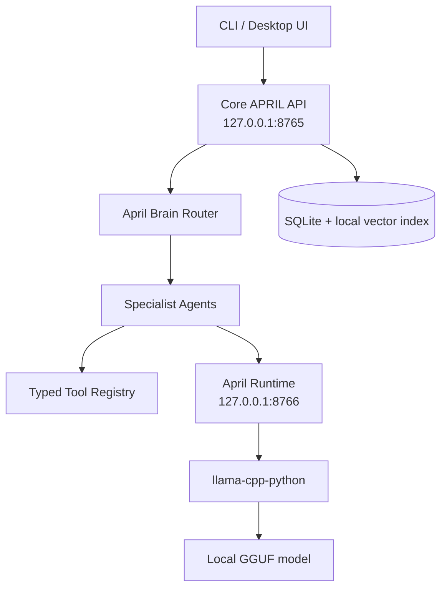

# APRIL

APRIL is a private, local-first AI assistant MVP for macOS. It is CLI-first, uses a separate local model service called April Runtime, supports specialist agents, stores inspectable local memory, and enforces deterministic tool permissions with exact-action approvals.

No model files are downloaded automatically. No cloud AI APIs, Ollama integration, telemetry, or unrestricted shell execution are included.

## Architecture



Only `services/april_runtime/llama_cpp_backend.py` imports `llama_cpp`. Agents and the core API talk to models through HTTP requests to April Runtime.

## Install

APRIL supports Python 3.11 through 3.13 for the Core MVP. Optional local
runtime and voice dependencies remain adapter-isolated.

```bash
python3.11 -m venv .venv
.venv/bin/pip install -e '.[dev]' -c constraints-dev.txt
```

Using the pinned `constraints-dev.txt` keeps NumPy and the type-checking toolchain
identical to CI. `make install-dev` installs the same `.[dev]` extra.

## Configuration

Defaults live in `configs/april.yaml`, `configs/models.yaml`,
`configs/agents.yaml`, `configs/tools.yaml`, and `configs/permissions.yaml`.
These files are active runtime policy, not documentation-only examples.
Environment overrides use the `APRIL_` prefix for local machine settings such
as ports, data paths, model backend, and allowed roots.

Useful local development settings:

```bash
export APRIL_RUNTIME_BACKEND=fake
export APRIL_API_TOKEN=local-dev-token
export APRIL_ALLOWED_FILESYSTEM_ROOTS="$PWD"
```

Both APIs bind to `127.0.0.1` by default. CORS is disabled by default.
The example tokens are development-only. For a non-development local setup,
generate random local tokens without printing them:

```bash
run april setup tokens --output .env
```

Set `APRIL_ENV=production` only after replacing the example tokens. In
production mode APRIL rejects known development tokens at startup.

### First-run bootstrap

`run april setup bootstrap` is a consolidated, **non-destructive, local-only**
first-run helper:

```bash
run april setup bootstrap                 # safe defaults
run april setup bootstrap --apply-profile # also apply the recommended profile
run april setup bootstrap --force         # regenerate tokens even if present
run april setup bootstrap --json          # machine-readable report
```

It creates APRIL's data/logs/models/vector-index/audit/audio-cache directories
with owner-only permissions; generates API/Runtime tokens into the chosen `.env`
only if absent (never printing full tokens, and refusing to overwrite existing
secrets without `--force`); inspects architecture, CPU count, and memory;
**recommends** a model profile without applying it (apply only with
`--apply-profile`); reports registered models and missing paths, llama-cpp-python
availability, voice dependency/binary/model paths, and configured allowed
filesystem roots; warns about known development tokens; runs configuration
validation; and prints the exact next commands for fake and real-model
verification. It never installs Homebrew, Python packages, models, or voice
binaries, and never edits shell startup files.

Development installs can use direct dependency constraints without pulling in
optional runtime or voice wheels:

```bash
python3.11 -m venv .venv
.venv/bin/pip install -e '.[dev]' -c constraints-dev.txt
```

## Local Models

APRIL never downloads models. Register existing local GGUF files with:

```bash
run april model import --role brain --id april-brain --name granite3.3-2b --path /absolute/path/model.gguf
run april model import --role coding --id april-coding --name qwen3-1.7b --path /absolute/path/model.gguf
run april model import --role reading --id april-reading --name qwen3-0.6b --path /absolute/path/model.gguf
```

If the source file is outside configured allowed roots, copy it into APRIL with:

```bash
run april model import --role brain --id april-brain --name granite3.3-2b --path /absolute/path/model.gguf --copy-into-models
```

CPU-only profiles are local config edits only:

```bash
run april model profile list
run april model profile apply intel_macbook_cpu_low
run april model doctor
run april verify --real-model /absolute/path/model.gguf
run april model benchmark /absolute/path/model.gguf --runs 1 --max-output-tokens 32
```

Missing files do not crash startup. With the real `llama_cpp` backend, runtime
health reports `degraded` and lists the missing model ids. With the fake backend
(`APRIL_RUNTIME_BACKEND=fake`), health reports `status: ok` with `simulated:
true` — a missing GGUF is informational (still listed under `missing_models`),
because the fake backend never loads model files. Genuine backend/model errors
still report `degraded` in both modes. The `simulated` flag means a fake run can
never be mistaken for real-model readiness; the Desktop Status screen shows a
clear "SIMULATED runtime" badge. Use `APRIL_RUNTIME_BACKEND=fake` for tests and
development without model files.

## What is implemented vs. verified

APRIL separates "implemented and tested against the fake/deterministic backend"
from "exercised against real hardware". The automated suite is large and green,
but a green suite verifies orchestration, permissions, and contracts — **not**
real models, live audio, or native Mac packaging.

| Capability | Status |
|---|---|
| Runtime, Brain routing, agents, permissions, memory, scheduler, documents, desktop SPA | Implemented, fake-backend tested |
| Brain agent-name schema constraint + repair/fallback | Implemented, fake-backend tested |
| Simulated vs. real runtime health (`simulated` flag) | Implemented, fake-backend tested |
| Scoped log/cache cleanup (plan + Level 4 approved apply) | Implemented, security-tested |
| Secure first-run bootstrap (`setup bootstrap`) | Implemented, tested with temp homes |
| Interactive push-to-talk (stop-controlled capture) | Implemented, tested with fake mic + mocked input |
| Real GGUF model load/chat/stream/unload | **Not verified here** — requires your local GGUF + `[runtime]` extra |
| Live microphone, whisper.cpp, Piper, wake-word | **Not verified here** — requires your local binaries/models |
| Real-model target-Mac acceptance report | Implemented; runs real checks only when you supply a GGUF |
| Signed/notarized packaging, launch-at-login | Out of scope (see below) |

Nothing in this repository has been run against a real GGUF model, a live
microphone, or native Mac packaging in the environment that produced it.

## Backends, Verification, and Honest Status

APRIL has three clearly separated execution paths. Do not assume one is verified
because another is.

- **Fake-backend development (`APRIL_RUNTIME_BACKEND=fake`).** Deterministic,
  needs no model files, and is what the automated suite and `run april verify
  --fake` exercise. A green test suite verifies the orchestration, permissions,
  memory, indexing, and API contracts — it does **not** verify any real model,
  audio device, or native window. Passing fake/mocked tests does not make a
  component production-ready.
- **Real llama.cpp runtime (`APRIL_RUNTIME_BACKEND=llama_cpp`, the default).**
  Requires the optional `.[runtime]` extra (`llama-cpp-python`) and local GGUF
  files that **you** provide. APRIL never downloads or commits models; the
  `models/` directory ships empty.
- **Optional voice dependencies.** Voice is off by default. It requires the
  `.[voice]` extra (`sounddevice`, `openwakeword`) plus whisper.cpp and Piper
  binaries/models you install yourself. It is entirely local. The voice pipeline
  has unit tests against synthetic PCM only; live microphone, openWakeWord,
  whisper.cpp, and Piper have not been verified in this environment.

`.env.example` documents `APRIL_RUNTIME_BACKEND` as commented-out: the effective
default is `llama_cpp` to match `configs/models.yaml`. Uncomment `=fake` only for
development and the deterministic verification flows.

### Real-model verification

The optional GGUF test and the real-model verification flow read
`APRIL_TEST_GGUF_PATH`. They skip clearly when it is unset and never download a
model:

```bash
# Run only the optional real-GGUF pytest (skips cleanly when the var is unset):
APRIL_TEST_GGUF_PATH=/absolute/path/to/model.gguf .venv/bin/python -m pytest tests/test_real_model_optional.py

# End-to-end real-model verification (load / chat / stream / unload):
run april verify --real-model /absolute/path/to/model.gguf
run april model benchmark /absolute/path/to/model.gguf --runs 1 --max-output-tokens 32
run april verify --target-mac --require-real-model /absolute/path/to/model.gguf
```

#### Machine-readable acceptance report

`run april verify --target-mac` accepts `--report PATH` to write a redacted JSON
acceptance report:

```bash
run april verify --target-mac \
  --require-real-model /absolute/path/to/model.gguf \
  --report data/verification/mac-report.json
```

The report contains **no** prompt content, generated text, tokens, secrets, or
absolute paths (only a model path *basename*). It records timestamp, OS/CPU
architecture, Python version, selected backend, model id/role/basename/
quantization, load success and duration, chat/structured-JSON/streaming/unload
success, first-token latency, output token count and tokens-per-second, context
size, process RSS, routing-eval totals and accuracy, explicitly skipped checks
with reasons, and a final `pass` / `degraded` / `fail` summary.

Structural correctness is the default acceptance criterion (Macs vary widely in
speed). Optional `--min-tokens-per-second`, `--max-load-seconds`, and
`--max-first-token-latency-seconds` thresholds only **downgrade** an otherwise
structurally-passing run to `degraded`; they never hard-fail on speed alone. When
no real model is supplied the real-model section is marked `attempted: false`, the
checks are listed as skipped with reasons, and the summary can never be `pass` —
the run is never silently relabeled as real-model verified.

### Reproducible development environment

Development and CI both install with the same pinned constraints so NumPy and the
type-checking toolchain do not drift:

```bash
python3.11 -m venv .venv
.venv/bin/pip install -e '.[dev]' -c constraints-dev.txt
```

`constraints-dev.txt` intentionally excludes `llama-cpp-python`, voice wheels, and
GGUF files; install those separately when you opt into the real runtime or voice.

### Intel vs Apple Silicon setup

`run april model recommend` inspects this machine (architecture, CPU count,
memory) and prints a profile recommendation, the expected backend, and the exact
commands you may run. It never installs, downloads, switches configuration, edits
shell files, or sends data.

- **Intel MacBook Pro (CPU-only).** No Metal. Keep contexts/batches conservative,
  one small brain model resident, specialists loaded on demand:

  ```bash
  run april model profile apply intel_macbook_cpu_low
  ```

- **Apple Silicon MacBook Pro.** Use an **arm64** Python and a Metal-enabled
  `llama-cpp-python` build (`n_gpu_layers: -1` offloads all layers). Unified
  memory is shared with the GPU; specialists are evicted on idle:

  ```bash
  python3 -c "import platform; print(platform.machine())"  # expect: arm64
  run april model profile apply apple_silicon_macbook
  ```

### Native desktop limitations

`run april desktop` serves a local SPA over authenticated loopback HTTP. The
optional `--native` window uses `pywebview` (`.[desktop]` extra) and fetches the
token through a minimal JS bridge. The app is **not** a signed/notarized macOS
application and does not launch at login. Those, like git push, email, payments,
deployment, cloud sync, telemetry, and model downloading, are explicitly out of
scope (see "Out of scope / later milestones").

## Hari's Local Setup Path

1. Install APRIL:

```bash
python3.11 -m venv .venv
.venv/bin/pip install -e '.[dev]'
make install-global-force
export PATH="$HOME/.local/bin:$PATH"
```

2. Import local GGUF models with `run april model import`.
3. Apply the Intel MacBook CPU profile:

```bash
run april model profile apply intel_macbook_cpu_low
```

4. Run model and fake verification:

```bash
run april model doctor
run april verify --fake
run april verify --real-model /absolute/path/model.gguf
run april eval brain --real-model /absolute/path/model.gguf
```

5. Configure local voice paths in `configs/april.yaml`, then run:

```bash
run april voice doctor
run april voice test-record --seconds 3
run april voice test-stt /path/to/audio.wav
run april voice test-tts "Hello Hari"
```

6. Start daily CLI usage:

```bash
run april --fake --oneshot ask "April, plan my work today."
run april ask "April, plan my work today."
```

## Start Services

Terminal 1:

```bash
make run-runtime
```

Terminal 2:

```bash
make run-api
```

CLI:

```bash
make cli
april health
april ask "April, plan my work today."
april models
```

## Run APRIL From Any Folder

Recommended zsh setup:

```bash
cd april
scripts/setup_mac.sh --base --global --add-to-path
source ~/.zshrc
run april --fake
```

Alternative without modifying shell config:

```bash
cd april
scripts/setup_mac.sh --base
make install-global
export PATH="$HOME/.local/bin:$PATH"
run april --fake
```

Fallback that always works after install, even before PATH reload:

```bash
"$HOME/.local/bin/run" april --fake
```

`run april` locates `APRIL_HOME`, starts April Runtime and the Core API when
they are missing, waits for both localhost health checks, then opens interactive
CLI chat. It does not start voice, wake-word, or microphone services. Services
still bind to `127.0.0.1`. Real GGUF models are optional for MVP testing; use
`--fake` to run with the fake backend.

Useful launcher commands:

```bash
run april --fake
april-run doctor
run april doctor
run april config validate
run april verify --fake
run april verify --workflow
run april verify --target-mac
run april model doctor
run april model profile list
run april status --json
run april status
run april stop
run april restart
run april logs --tail 100
run april ask "April, plan my work today."
run april health
run april models
run april approvals
run april approve APPROVAL_ID
run april deny APPROVAL_ID
run april agent run coding_agent "Inspect this repository" --project-id PROJECT_ID
run april config inspect
run april setup tokens --output .env
run april setup bootstrap
run april verify --target-mac --report data/verification/mac-report.json
run april reminder list
run april reminder create "stand up" --due-at 2026-06-21T09:00:00Z
run april reminder delete REMINDER_ID
run april task list
run april briefing
run april voice health
run april voice doctor
run april voice devices
run april voice test-record --seconds 3
run april voice test-stt /path/to/audio.wav
run april voice test-tts "Hello Hari"
run april voice ptt
run april voice listen
run april memory doctor
run april eval brain --fake
```

`run april --fake` starts missing services with `APRIL_RUNTIME_BACKEND=fake`
without editing `.env`. Services still bind to `127.0.0.1`; PID files are under
`data/run/`, and logs are written to `logs/runtime.log` and `logs/api.log`.

Uninstall only APRIL-owned wrappers:

```bash
make uninstall-global
```

Troubleshooting `zsh: command not found: run`:

Cause: the APRIL wrapper is not installed or `~/.local/bin` is not in PATH.

Temporary fix for the current shell:

```bash
cd april
make install-global
export PATH="$HOME/.local/bin:$PATH"
run april --fake
```

Permanent zsh fix:

```bash
cd april
make install-global-path
source ~/.zshrc
run april --fake
```

If `run` resolves to a different command, inspect with:

```bash
april-run doctor
```

Then force-replace only when you intend to replace the existing `run` command:

```bash
make install-global-force
```

## Approval Example

```bash
april ask "Apply the fix." --project-id PROJECT_ID
april approvals
april approve APPROVAL_ID
```

APRIL never treats a casual "yes" inside chat as approval. Approval must reference the exact approval ID or use the dedicated CLI/API approval flow. Before an approved tool runs, APRIL reloads the approval, revalidates current tool policy for the scoped agent, verifies the exact argument hash, records the tool call, consumes the approval once, and audits the outcome.

For natural chat code changes such as `april ask "Apply the fix." --project-id
PROJECT_ID`, the Coding Agent now runs through the structured specialist loop:
it can inspect project files, ask `patch_generator` to create an immutable patch
artifact, ask `patch_applier` to apply it, suspend for approval, and resume the
same agent run after approval returns the exact tool result.

Patch proposals are stored in APRIL's content-addressed artifact store under
`data/artifacts/patches/`. The artifact may live outside the selected
repository, but every patch target must still resolve inside the selected
project. Patch approvals bind the artifact ID, patch SHA-256, exact byte length,
affected paths, selected project ID, repository root, available Git state,
expected side effects, expiry, and approval ID. Before applying, APRIL loads the
approved immutable bytes, recalculates the digest, validates target paths again,
then runs `git -C REPO apply --check -` and `git -C REPO apply -` against those
same in-memory bytes. Git commit approvals bind the exact staged diff digest,
staged tree ID, commit message, and repository identity.

## Repository Analysis Example

```bash
export APRIL_ALLOWED_FILESYSTEM_ROOTS="$PWD"
april project add "$PWD"
april ask "April, check why the animation in this repository is broken." --project-id PROJECT_ID
```

Repository work requires an explicit selected project through `project_id` or `repo_path`; APRIL no longer guesses a repository from the first allowed root. The coding agent can use read-only Git and filesystem tools without approval. File edits, patch application, test execution, and commits require approval.

When a project is selected, APRIL derives project-scoped tool roots from trusted
application state. Model-provided repository roots or absolute file paths cannot
override the selected project.

## Streaming

`POST /chat/stream` uses real runtime streaming. The Core API routes the request, runs permitted tools, stops immediately for approvals, and then forwards token events from April Runtime without buffering the full response. SSE events include `meta`, `token`, `approval_required`, `usage`, `done`, and `error`.

## Desktop UI

A local single-page Desktop UI ships as plain static HTML/CSS/JS (no Node, npm,
or build step). The Core API serves it at `GET /desktop` over authenticated
loopback HTTP; the static assets are the only unauthenticated surface besides the
redacted `GET /health`.

```bash
run april desktop          # ensure services, open the browser to the UI
run april desktop --fake   # same with the deterministic fake runtime
run april desktop --native # optional native window (pip install -e '.[desktop]')
```

The launcher never starts voice/wake-word/microphone. The API token is passed in
the URL **fragment** (`/desktop#token=...`), which is never sent to the server; the
SPA reads it into memory and immediately strips it from the address bar, and never
persists it to `localStorage`/`sessionStorage`. The native window injects the token
through the JS bridge instead of any URL. Screens: Chat (streamed), Projects,
Approvals (exact-ID, never an implicit "yes"), Memory, Reminders & Tasks with
today's briefing, Status & Models, and a redacted Activity/Logs feed from
`GET /diagnostics/activity`. See `apps/desktop/README.md` for details.

## Conversations

`POST /chat` accepts an optional `conversation_id`. If omitted, APRIL creates a
local conversation and returns its ID in `result.conversation_id`. The
interactive CLI creates one conversation ID per chat session and reuses it for
every turn. Recent bounded history is included in the next agent prompt as
context, not instructions.

Conversations are bound to either a selected project ID or explicit no-project
scope. APRIL rejects attempts to reuse a project conversation with a different
project. Brain routing and code-modification planning receive bounded recent
history as context.

## Structured Agents

Specialist agents use the structured loop by default for `/chat` and
`/agents/run`: Coding, Reading, Reasoning, System Action, and Creative when it
requests tools. General Agent simple chat remains a direct model response.

Specialist output must be exactly one JSON object: `final_answer`,
`tool_request`, `approval_required`, or `structured_error`. The loop enforces the
configured agent model, allowed/blocked tools, maximum iterations, and
permission gates. Level 3+ tool requests create exact approvals and persist a
suspended run. Approving the ID executes the exact tool once, appends the
sanitized result, and resumes the same run. `APRIL_LEGACY_ORCHESTRATOR=1`
temporarily restores the previous planned-tool path for compatibility testing.

### Deep Reasoning

Deep reasoning ("architecture mode") is always available. The Reasoning Agent
runs on the brain model by default, so requests like "reason through the
trade-offs", "compare approaches", or "weigh the options on this architectural
decision" route to it and return a real answer with no extra setup.

If you register a larger model with `role: reasoning`, APRIL automatically uses
it for reasoning runs whenever the runtime reports it as available, and falls
back to the brain model on any error. Register one with:

```bash
run april model import --role reasoning --id april-reasoning \
  --path models/your-reasoning-model-q4_k_m.gguf
```

See the commented `reasoning:` example in `configs/models.yaml`. The Reasoning
Agent is read-only (it keeps `read_file`, `search_files`, `git_status`, and
`git_diff`; it cannot write files or run commands).
Reasoning agent run metadata records the requested role, selected model, and
fallback reason without storing prompt content.

## Memory

Memory is local SQLite plus a local vector index:

```bash
april memory search "project preference"
april memory delete MEMORY_ID
april memory export
april conversation delete CONVERSATION_ID
```

Durable memory is not created automatically from every message. Explicit
requests such as "remember..." or `POST /memory` use the local `remember_memory`
Level 2 flow, reject sensitive-looking content by policy, and deduplicate exact
content/type/project repeats. Project-scoped memory search/export can be
filtered by `project_id` so unrelated projects stay isolated.

When the brain supplies `memory_queries`, APRIL retrieves local memories by policy and includes them in the agent prompt under a clearly marked context section. General planning requests also receive a small set of recent durable memories. Coding requests with a selected indexed project retrieve project-scoped vector chunks with local citations.

### Embeddings

The vector index defaults to a deterministic, dependency-free **hashed-token**
embedding. To use real **runtime-local** semantic embeddings served by a local
GGUF model through April Runtime:

```bash
# 1. Register a local embedding-role GGUF model
run april model import --role embedding --id april-embedding \
  --path models/your-embedding-model-q4_k_m.gguf

# 2. Select the runtime-local provider
export APRIL_MEMORY_EMBEDDING_PROVIDER=runtime-local
export APRIL_MEMORY_EMBEDDING_MODEL_ID=april-embedding   # optional; auto-detected

# 3. Rebuild the index under the new provider
run april memory reindex
```

The embedding model is loaded as its own dedicated instance (a chat model
cannot also embed) and is exempt from chat-specialist load/eviction limits, so
enabling it does not evict your coding or reading models.

Graceful degradation is built in: if `embedding_provider=runtime-local` is set
but no embedding-role model is registered (or the runtime reports it
unavailable), APRIL logs and audits a clear note and **falls back to
hashed-token embeddings** instead of crashing.

Switching embedding providers changes the vector space, so APRIL refuses to
silently mix spaces: searches/writes against an index built with a different
provider/dimension raise an actionable error pointing you to
`run april memory reindex`. Reindexing re-embeds existing memories and known
sources under the current provider — it never wipes your index without this
explicit command.

Document ingestion is offline. Text/source files are supported by default; PDF
text extraction is local and optional via `pip install -e '.[documents]'`.
Unsupported binary formats are reported as unsupported instead of being decoded
as arbitrary text. OCR, cloud parsing, DOCX, and HTML extraction are future
extensions.

## Voice

Voice is optional and disabled by default. Configure local `whisper.cpp`,
Piper, optional `sounddevice`, and optional openWakeWord model paths in
`configs/april.yaml` or environment variables. No voice model, speech model,
wake-word model, or binary is downloaded by APRIL.

```bash
april voice health
april voice devices
april voice ptt
april voice listen
```

`run april voice ptt` (no `--seconds`) is genuinely interactive: press Enter to
start capture and Enter again to stop. Capture also ends on the configured
maximum duration, the frame source ending, cancellation (Ctrl+C), or error, and
the microphone frame source is closed on every exit path. Empty audio produces a
clear error, and temporary capture audio is deleted unless `retain_debug_audio`
is enabled. `run april voice ptt --seconds N` remains a deterministic
fixed-duration mode for scripts and smoke tests. (Interactive PTT is verified
with a fake microphone and mocked input; it has not been exercised against a live
microphone in this environment.)

Wake-word ("April") listening needs a **custom local openWakeWord model** you
configure at `voice.wake_word_model_path`; APRIL never downloads or trains a
wake-word model. Push-to-talk works without any wake-word model, and wake-word
mode falls back to push-to-talk when no model is configured. `run april voice
doctor` states this explicitly.

Push-to-talk starts only from explicit CLI invocation. API, Runtime, desktop, and
normal CLI startup never activate the microphone.

## Proactive Scheduler

The scheduler is optional and **off by default**. When enabled it runs a
background poll loop that fires due reminders through a notification sink, and an
optional daily briefing summarizing open tasks, reminders due in the next 24
hours, and the project count. It is never activated implicitly by API startup;
both the loop and briefings stay inert unless explicitly enabled in settings.

Enable it in `configs/april.yaml` (or the matching `APRIL_SCHEDULER_*`
environment variables):

```yaml
scheduler:
  enabled: true            # start the background reminder loop
  poll_interval_seconds: 30
  notification_sink: log   # "log" (logs/scheduler.log) or "macos" (native banner)
  briefing_enabled: true   # fire a daily briefing
  briefing_time: "08:00"   # local time, once per local day
  repo_monitor_enabled: true  # add read-only repo activity to the briefing
```

When `repo_monitor_enabled` is true, the briefing appends a read-only "Project
activity" section listing registered git projects with new commits or uncommitted
changes since the last briefing (all git access is local; `run april briefing`
previews this without advancing the baseline).

The daily briefing is restart-safe: the last briefing date is persisted, so it
fires at most once per local day even if the process restarts. You can preview
today's briefing on demand at any time, regardless of whether the scheduler is
enabled:

```bash
run april briefing
```

This calls the authenticated `GET /scheduler/briefing/preview` endpoint and
renders the title and body. `GET /health` reports the scheduler block
(`enabled`, `running`, `briefing_enabled`, `fired_reminders`).

## Quality Gates

```bash
make test
make lint
make typecheck
make check
run april config validate
run april verify --fake
run april verify --target-mac
```

Tests use fake model/audio components and do not require GGUF files, network access, microphones, speakers, whisper.cpp, Piper, openWakeWord, or `llama-cpp-python`.

`run april verify --fake` is a release smoke gate. It checks project-bound
conversations, immutable patch application, tampered artifact rejection, repo
override rejection, forced command working directories, audit records,
tool-call rows, and exactly one runtime streaming usage event.

`run april verify --target-mac` is the local target-laptop checklist. It reports
pass, fail, skip, and manual-check rows for architecture, Python, llama.cpp
availability, configured GGUF readability, real model load/chat/stream/unload
when a local model is supplied, voice dependencies, and push-to-talk smoke
steps. It never downloads models or changes system settings. Use
`--require-real-model` with a GGUF path or `APRIL_TEST_GGUF_PATH` when missing
real-model support should fail the command.

## Security Model

- Model output is advisory only.
- Unknown tools are denied.
- Permission level and risk are computed deterministically from tool policy and arguments.
- Every tool call runs through a trusted `ToolExecutionContext` containing the
  request, actor, agent, selected project, approval, and audit correlation. For
  project tools, APRIL derives the repository root from the registered project;
  model-supplied roots cannot override it.
- Level 3 and above operations require exact-action one-time approvals.
- Filesystem access is restricted to configured roots and rejects traversal, symlink escapes, sensitive locations, binary files, and oversize reads.
- Sensitive file names such as `.env`, `.env.*`, `.netrc`, private keys,
  credential files, browser credential stores, keychains, and `data/april.db`
  are denied case-insensitively.
- Subprocess execution uses argv arrays with `shell=False`; pipes, redirects,
  substitutions, shell interpreters, package installers, arbitrary `python -m`
  modules, and shell metacharacters are denied.
- External actions are disabled by default and not simulated.
- `open_app` is Level 4 and can only open configured macOS application names
  with `/usr/bin/open -a` after exact approval.
- `open_url` is Level 5, requires `external_actions_enabled`, accepts only
  normalized `http`/`https` URLs without credentials, and requires exact
  approval.
- There is **no** generic, recursive, or caller-rooted delete tool. The only way
  to delete files is the scoped two-stage cleanup below.

### Scoped log/cache cleanup

Removing old logs or audio cache uses an immutable two-stage flow modeled on the
secure patch boundary — not a generic delete:

```bash
# Stage 1 — plan (Level 1, read-only): enumerates candidates into an immutable
# manifest and deletes nothing.
april ask "Delete the old logs from this machine." --project-id PROJECT_ID
april approvals          # shows the apply_log_cleanup approval with file count + bytes
april approve APPROVAL_ID
```

`plan_log_cleanup` accepts only a controlled target (`logs` or `audio_cache`) and
a bounded `older_than_days`; the root is derived from settings (never from the
caller). It enumerates only ordinary files (skipping symlinks, the audit log, and
`.gitkeep`), enforces configurable max-file and max-byte limits, and writes a
content-addressed manifest. `apply_log_cleanup` is a **Level 4** system action
requiring exact one-time approval bound to that manifest: before deleting it
revalidates root containment and each file's size + SHA-256, never follows
symlinks, never deletes directories, cannot broaden the candidate set, fails
closed on a tampered manifest, and marks the manifest one-time-use to prevent
replay. Limits live in `configs/tools.yaml` under `tools.log_cleanup`.

## Limitations

- The MVP fake backend is deterministic and not intelligent.
- The default vector embedding is a lightweight hashed-token baseline. Real semantic embeddings are available by registering a local embedding model and setting `embedding_provider=runtime-local` (see Memory → Embeddings).
- The Desktop UI is a local static SPA served by the Core API at `/desktop` and
  launched with `run april desktop`. It has no Node/npm/build step and adds no
  public surface; the optional native window needs the `[desktop]` extra.
- Real wake-word, STT, and TTS require user-installed local binaries/models.
- Real GGUF inference requires manually installed model files and the optional `llama-cpp-python` dependency.

## Out of scope / later milestones

These are intentionally **not** implemented and are documented as later
milestones rather than hidden gaps:

- git push, email sending, deployment, payments, and other external actions
- arbitrary package installation and unrestricted command execution
- broad/recursive file deletion
- cloud sync, telemetry, and any automatic model downloading
- signed/notarized macOS application packaging and launch-at-login
- external connectors

Model files are never committed to this repository and are never downloaded
automatically; you provide them locally.
