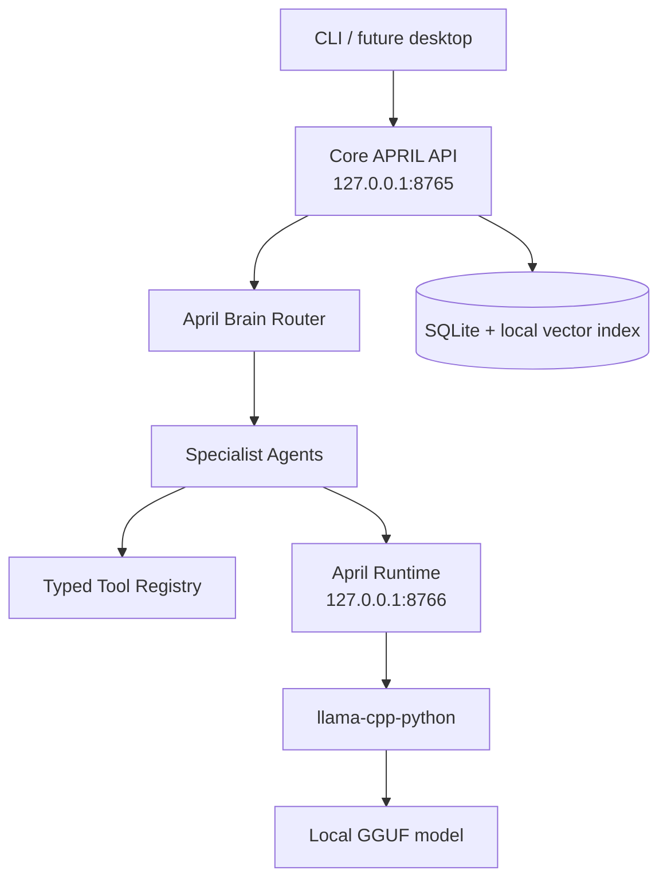

# APRIL

APRIL is a private, local-first AI assistant MVP for macOS. It is CLI-first, uses a separate local model service called April Runtime, supports specialist agents, stores inspectable local memory, and enforces deterministic tool permissions with exact-action approvals.

No model files are downloaded automatically. No cloud AI APIs, Ollama integration, telemetry, or unrestricted shell execution are included.

## Architecture



Only `services/april_runtime/llama_cpp_backend.py` imports `llama_cpp`. Agents and the core API talk to models through HTTP requests to April Runtime.

## Install

```bash
python3.11 -m venv .venv
.venv/bin/pip install -e '.[dev]'
```

Or:

```bash
make install-dev
```

## Configuration

Defaults live in `configs/april.yaml` and `configs/models.yaml`. Environment overrides use the `APRIL_` prefix.

Useful local development settings:

```bash
export APRIL_RUNTIME_BACKEND=fake
export APRIL_API_TOKEN=local-dev-token
export APRIL_ALLOWED_FILESYSTEM_ROOTS="$PWD"
```

Both APIs bind to `127.0.0.1` by default. CORS is disabled by default.

## Local Models

Place GGUF files manually under `models/` using the names configured in `configs/models.yaml`:

- `models/granite3.3-2b-q4_k_m.gguf`
- `models/qwen3-1.7b-q8_0.gguf`
- `models/qwen3-0.6b-q8_0.gguf`

Missing files do not crash startup. Runtime health reports degraded status. Use `APRIL_RUNTIME_BACKEND=fake` for tests and development without model files.

## Start Services

Terminal 1:

```bash
make run-runtime
```

Terminal 2:

```bash
make run-api
```

CLI:

```bash
make cli
april health
april ask "April, plan my work today."
april models
```

## Approval Example

```bash
april ask "Apply the fix." --project-id PROJECT_ID
april approvals
april approve APPROVAL_ID
```

APRIL never treats a casual "yes" inside chat as approval. Approval must reference the exact approval ID or use the dedicated CLI/API approval flow. Before an approved tool runs, APRIL reloads the approval, revalidates current tool policy for the scoped agent, verifies the exact argument hash, records the tool call, consumes the approval once, and audits the outcome.

## Repository Analysis Example

```bash
export APRIL_ALLOWED_FILESYSTEM_ROOTS="$PWD"
april project add "$PWD"
april ask "April, check why the animation in this repository is broken." --project-id PROJECT_ID
```

Repository work requires an explicit selected project through `project_id` or `repo_path`; APRIL no longer guesses a repository from the first allowed root. The coding agent can use read-only Git and filesystem tools without approval. File edits, patch application, test execution, and commits require approval.

## Streaming

`POST /chat/stream` uses real runtime streaming. The Core API routes the request, runs permitted tools, stops immediately for approvals, and then forwards token events from April Runtime without buffering the full response. SSE events include `meta`, `token`, `approval_required`, `usage`, `done`, and `error`.

## Memory

Memory is local SQLite plus a local vector index:

```bash
april memory search "project preference"
april memory delete MEMORY_ID
april memory export
april conversation delete CONVERSATION_ID
```

Durable memory is not created automatically from every message. Sensitive-looking content is rejected by policy.

When the brain supplies `memory_queries`, APRIL retrieves local memories by policy and includes them in the agent prompt under a clearly marked context section. General planning requests also receive a small set of recent durable memories. Coding requests with a selected indexed project retrieve project-scoped vector chunks with local citations.

## Voice

Voice is optional and disabled by default. Configure local `whisper.cpp` and Piper paths in `configs/april.yaml` or environment variables. No voice model or binary is downloaded by APRIL.

```bash
april voice ptt
```

Push-to-talk starts only from explicit CLI invocation.

## Quality Gates

```bash
make test
make lint
make typecheck
make check
```

Tests use fake model/audio components and do not require GGUF files, network access, microphones, speakers, whisper.cpp, Piper, openWakeWord, or `llama-cpp-python`.

## Security Model

- Model output is advisory only.
- Unknown tools are denied.
- Permission level and risk are computed deterministically from tool policy and arguments.
- Level 3 and above operations require exact-action one-time approvals.
- Filesystem access is restricted to configured roots and rejects traversal, symlink escapes, sensitive locations, binary files, and oversize reads.
- Subprocess execution uses argv arrays with `shell=False`; pipes, redirects, substitutions, and shell metacharacters are denied.
- External actions are disabled by default and not simulated.

## Limitations

- The MVP fake backend is deterministic and not intelligent.
- The default vector embedding is a lightweight hashed-token baseline, not a semantic embedding model.
- Desktop UI is documented as a future surface.
- Real wake-word, STT, and TTS require user-installed local binaries/models.
- Real GGUF inference requires manually installed model files and the optional `llama-cpp-python` dependency.
