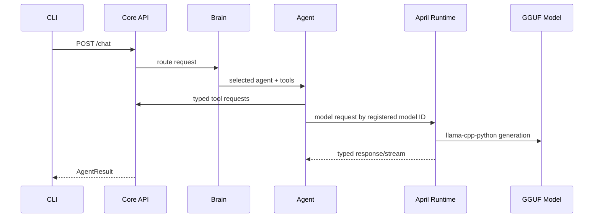

# Architecture

APRIL runs as two local processes:

Only April Runtime imports `llama_cpp`. This keeps model bindings isolated from tools, memory, and permissions.

Core API responsibilities:

- authentication
- orchestration
- permission checks
- approval flow
- memory
- tool execution
- runtime proxying

April Runtime responsibilities:

- model registry validation
- model lifecycle
- prompt/context management
- generation locking
- SSE streaming
- optional llama.cpp integration
