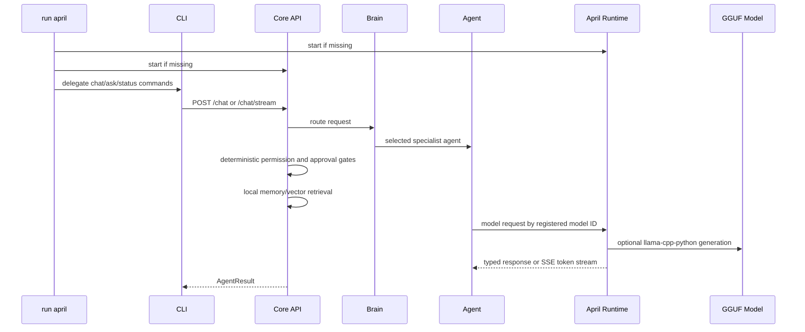

# Architecture

APRIL runs as two local processes:

Only April Runtime imports `llama_cpp`. This keeps model bindings isolated from tools, memory, and permissions.

Core API responsibilities:

- authentication
- orchestration
- permission checks
- approval flow
- active YAML policy loading for agents, tools, and permissions
- memory
- project selection and repository indexing
- reminders and task inspection
- tool execution
- runtime proxying and token streaming

All tool calls now pass through a trusted `ToolExecutionContext`. The context is
created by APRIL application code, not by the model, and carries request ID,
actor, agent, selected project, trusted project root, approval ID, permission
decision, source, and audit correlation. Project-scoped tools derive repository
roots from SQLite project records.

April Runtime responsibilities:

- model registry validation
- model lifecycle
- prompt/context management
- generation locking
- SSE streaming
- optional llama.cpp integration

Runtime behavior is driven by `configs/models.yaml` plus
`configs/april.yaml`. Keep-loaded models remain resident, non-keep-loaded
specialists load on demand, idle specialist models can unload after their
configured timeout, and a deterministic priority/LRU policy enforces the
configured maximum loaded specialist count. Active requests are never evicted.

Repository operations require an explicit selected project. The orchestrator resolves `project_id` from SQLite or validates a supplied `repo_path` against allowed roots before any repository tool or vector retrieval runs.

The optional global launcher is intentionally small: it owns only known APRIL
subcommands, uses argv-array subprocess calls, records PIDs under `data/run/`,
and writes service logs under `logs/`. It does not start desktop UI or
background microphone capture. Voice starts only through explicit `voice`
commands.

Specialist agents now execute through `StructuredAgentLoop` by default. The
Brain still selects the agent for natural `/chat`, but Coding, Reading,
Reasoning, System Action, and tool-using Creative turns run as strict JSON
iterations. General Agent chat remains a direct response path.

Natural chat code modification follows the structured tool boundary. The Coding
Agent may inspect files, request `patch_generator`, request `patch_applier`,
suspend for a Level 3 exact-action approval, and resume the same persisted run
after approval. Patch approvals bind the immutable APRIL-owned artifact bytes.
Approved patch application uses `git apply --check -` and `git apply -` with the
same verified in-memory bytes.

Suspended runs are stored in SQLite with the agent run ID, conversation/project
scope, agent/model IDs, current iteration, sanitized loop messages, exact tool
request, normalized args, approval ID, request ID, and context metadata. If the
conversation or project is gone, replayed, denied, expired, or tampered, APRIL
does not execute the tool and does not resume the model loop.

`run april verify --fake` starts isolated temporary Runtime/Core services on
dynamic loopback ports, creates a temporary external Git project, exercises
chat, direct `/agents/run`, structured specialist approval/resume, immutable
patch approval/application, tampered artifact rejection, approval replay
rejection, repo override rejection, command cwd forcing, audit/tool-call checks,
agent run/iteration/suspension rows, and runtime streaming, then stops the
services.
