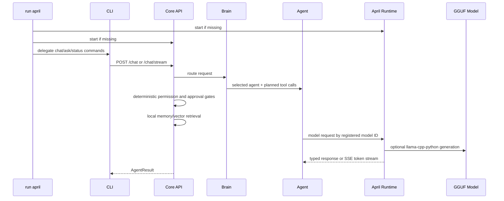

# Architecture

APRIL runs as two local processes:

Only April Runtime imports `llama_cpp`. This keeps model bindings isolated from tools, memory, and permissions.

Core API responsibilities:

- authentication
- orchestration
- permission checks
- approval flow
- memory
- project selection and repository indexing
- tool execution
- runtime proxying and token streaming

April Runtime responsibilities:

- model registry validation
- model lifecycle
- prompt/context management
- generation locking
- SSE streaming
- optional llama.cpp integration

Repository operations require an explicit selected project. The orchestrator resolves `project_id` from SQLite or validates a supplied `repo_path` against allowed roots before any repository tool or vector retrieval runs.

The optional global launcher is intentionally small: it owns only known APRIL
subcommands, uses argv-array subprocess calls, records PIDs under `data/run/`,
and writes service logs under `logs/`. It does not start desktop UI, voice,
wake-word detection, or microphone capture.

Natural chat code modification follows a patch-first boundary. The coding model
may propose a unified diff, but APRIL validates the patch target paths, saves
the patch as a safe local draft, and requires a Level 3 exact-action approval
before `patch_applier` can apply it once. That approval binds the patch digest,
affected paths, repository root, available Git state, and expected side effects;
APRIL recalculates those values before applying the patch.
