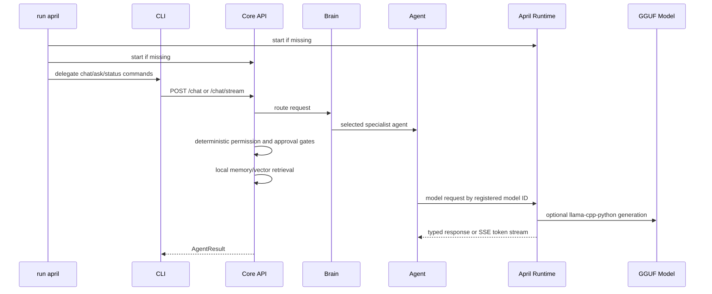

# Architecture

APRIL runs as two local processes:

```mermaid
sequenceDiagram
  participant Run as run april
  participant CLI
  participant API as Core API
  participant Brain
  participant Agent
  participant Runtime as April Runtime
  participant Model as GGUF Model

  Run->>Runtime: start if missing
  Run->>API: start if missing
  Run->>CLI: delegate chat/ask/status commands
  CLI->>API: POST /chat or /chat/stream
  API->>Brain: route request
  Brain->>Agent: selected specialist agent
  API->>API: deterministic permission and approval gates
  API->>API: local memory/vector retrieval
  Agent->>Runtime: model request by registered model ID
  Runtime->>Model: optional llama-cpp-python generation
  Runtime-->>Agent: typed response or SSE token stream
  API-->>CLI: AgentResult
```

Only April Runtime imports `llama_cpp`. This keeps model bindings isolated from tools, memory, and permissions.

Core API responsibilities:

- authentication
- orchestration
- permission checks
- approval flow
- active YAML policy loading for agents, tools, and permissions
- memory
- project selection and repository indexing
- reminders and task inspection
- tool execution
- runtime proxying and token streaming
- authenticated readiness and latest redacted verification-report summaries

All tool calls now pass through a trusted `ToolExecutionContext`. The context is
created by APRIL application code, not by the model, and carries request ID,
actor, agent, selected project, trusted project root, approval ID, permission
decision, source, and audit correlation. Project-scoped tools derive repository
roots from SQLite project records.

April Runtime responsibilities:

- model registry validation
- model lifecycle
- prompt/context management
- generation locking
- SSE streaming
- optional llama.cpp integration

Runtime behavior is driven by `configs/models.yaml` plus
`configs/april.yaml`. Keep-loaded models remain resident, non-keep-loaded
specialists load on demand, idle specialist models can unload after their
configured timeout, and a deterministic priority/LRU policy enforces the
configured maximum loaded specialist count. Active requests are never evicted.

Repository operations require an explicit selected project. The orchestrator resolves `project_id` from SQLite or validates a supplied `repo_path` against allowed roots before any repository tool or vector retrieval runs.

The optional global launcher is intentionally small: it owns only known APRIL
subcommands, uses argv-array subprocess calls, records PIDs under `data/run/`,
and writes service logs under `logs/`. It does not start desktop UI or
background microphone capture. Voice starts only through explicit `voice`
commands.

## Wake layer

`services/wake/sentinel.py` is the sole microphone owner. Sentinel scores local
audio with the configured wake models, retains bounded pre-roll in
`services/wake/ring_buffer.py`, and hands those buffered frames to local STT
confirmation; the confirmer never opens another microphone stream. The
file-backed mute switch closes the active stream and prevents capture until it
is cleared. Wake and voice remain off by default.

Accepted events use `services/wake/schemas.py` and enter session continuity
through `services/wake/session_manager.py`. Other local surfaces can submit the
same bounded event over the owner-only Unix socket in
`services/wake/wake_bus.py`. The optional soft speaker gate is a convenience
filter, not authentication or a permission boundary, and degrades to off with
an audited warning when no local verifier is available.

## Resident daemon and governor

`apps/daemon/apriald.py` is a single-instance local supervisor. It starts and
health-checks April Runtime and Core API, adds Sentinel only when both voice and
wake are explicitly enabled, restarts failed children with bounded exponential
backoff, and records owner-local lock, PID, and JSON status artifacts under
`data/`. Its launchd integration is a per-user LaunchAgent and never requires
root privileges.

`services/pool/governor.py` samples local RAM and CPU for resident work and adds
power and trusted-idle requirements for background Dreamer work. Unknown power
or idle signals fail closed for background work. Interactive model loads are
not blocked merely because the Mac is on battery or the user is active; the
governor instead supplies the smaller active-user generation-thread budget,
which April Runtime applies at the next safe model load or reload.

## Evolution pipeline

`services/memory/archive.py` reflects closed sessions into bounded,
machine-written memories after confidence and sensitivity checks. Retrieved
memory is labelled as context, never instructions. `services/evolution/dreamer.py`
runs the gated D1-D6 replay, distill, playbook-mine, evolve, examine, and report
phases. D1-D5 run inside the disarmed context in
`services/evolution/disarm.py`, so the normal tool-execution service refuses
even read-only tool calls from a Dreamer phase.

`services/evolution/write_guard.py` fences filesystem artifacts to
`data/evolution/` and `data/playbooks/` and database mutations to its explicit
table allow-list. Prompt guidance is appended after immutable base agent
prompts; tool and permission policy still comes from typed configuration, not
prompt text. Prompt and ladder-threshold overlays and LoRA adapter pointers use
baseline/evidence gates, audit records, immutable versions, and rollback.
Deleting `data/evolution/` restores stock prompt, ladder-threshold, and adapter
behavior; learned playbooks are separately removable under `data/playbooks/`.

Desktop is a static HTML/CSS/vanilla JS SPA served by the Core API. Its
Readiness screen calls authenticated sanitized endpoints only:
`GET /readiness`, `GET /verification/report/latest`, and
`GET /verification/reports`. Report endpoints read only APRIL-owned
`data/verification/*.json`, reject arbitrary path input, and project known
report types into safe fields. Desktop never starts model loading, verification,
microphone recording, wake-word listening, or command execution automatically.

Specialist agents now execute through `StructuredAgentLoop` by default. The
Brain still selects the agent for natural `/chat`, but Coding, Reading,
Reasoning, System Action, and tool-using Creative turns run as strict JSON
iterations. General Agent chat remains a direct response path.

Natural chat code modification follows the structured tool boundary. The Coding
Agent may inspect files, request `patch_generator`, request `patch_applier`,
suspend for a Level 3 exact-action approval, and resume the same persisted run
after approval. Patch approvals bind the immutable APRIL-owned artifact bytes.
Approved patch application uses `git apply --check -` and `git apply -` with the
same verified in-memory bytes.

Suspended runs are stored in SQLite with the agent run ID, conversation/project
scope, agent/model IDs, current iteration, sanitized loop messages, exact tool
request, normalized args, approval ID, request ID, and context metadata. If the
conversation or project is gone, replayed, denied, expired, or tampered, APRIL
does not execute the tool and does not resume the model loop.

`run april verify --fake` starts isolated temporary Runtime/Core services on
dynamic loopback ports, creates a temporary external Git project, exercises
chat, direct `/agents/run`, structured specialist approval/resume, immutable
patch approval/application, tampered artifact rejection, approval replay
rejection, repo override rejection, command cwd forcing, audit/tool-call checks,
agent run/iteration/suspension rows, and runtime streaming, then stops the
services.

`run april verify --all-configured-models` (`--mac-readiness`) is the real
multi-model readiness path. It requires local GGUF files and `llama-cpp-python`
for real verification, skips missing optional models instead of passing them,
and writes redacted reports with basenames only plus verification levels
(`none`, `partial`, `core`, `all`). `run april voice verify-live` is the explicit
live audio path and asks before recording. `scripts/create_macos_app_stub.sh` and
`run april setup app-stub` create an unsigned local development launcher only;
they bundle no models, tokens, voice assets, signing, or launch-at-login service.
