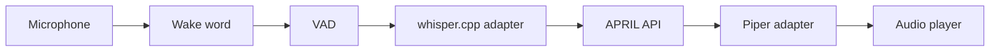

# Voice Design

Voice is optional and disabled by default.

Pipeline:



Rules:

- no downloads
- no microphone activation at API startup
- explicit CLI/service invocation only
- temporary audio under configured cache
- recordings removed by default
- fake STT/TTS are used in tests

Implemented adapters:

- `SoundDeviceMicrophone` records explicit push-to-talk captures as bounded
  16 kHz mono 16-bit PCM WAV and reports actionable macOS permission errors.
- `SoundDeviceAudioPlayer` validates WAV input, supports a configured output
  device, and plays through `sounddevice` only when explicitly invoked.
- `VoiceActivityDetector` provides deterministic energy-based VAD with
  configurable threshold and required speech frames. It computes signed 16-bit
  little-endian PCM RMS locally and does not depend on Python's removed
  `audioop` module.
- `OpenWakeWordDetector` lazily imports openWakeWord, requires an explicitly
  configured local ONNX model, validates 16-bit PCM frames, and never downloads
  models.

CLI commands:

```bash
april voice health
april voice doctor
april voice devices
april voice test-record --seconds 3
april voice test-stt /path/to/audio.wav
april voice test-tts "Hello Hari"
april voice ptt
april voice listen
run april setup voice \
  --whisper-binary /path/to/whisper.cpp/main \
  --whisper-model /path/to/ggml-base.en.bin \
  --piper-binary /path/to/piper \
  --piper-model /path/to/voice.onnx \
  --wake-word-model /path/to/april.onnx \
  --dry-run
run april voice verify-live --report data/verification/voice-live.json
```

`run april setup voice` is a non-recording configuration helper. It validates
local whisper.cpp and Piper paths, treats a missing wake-word model as non-fatal,
does not download assets, does not open the microphone, does not start
wake-word listening, does not synthesize or play audio, and writes
`configs/april.yaml` only with `--apply` after creating a backup.

`voice ptt` keeps a persistent conversation ID for the loop, transcribes with
the configured local whisper.cpp adapter, passes `conversation_id` through
`/voice/input`, synthesizes with Piper, plays the response, and removes
temporary audio unless debug retention is enabled. `voice listen` is optional
wake-word mode and falls back to explicit push-to-talk behavior when wake-word
support is unavailable.

`PushToTalkLoop` takes an injectable capture strategy so it never duplicates
recording logic:

- With no `--seconds`, `voice ptt` injects `interactive_capture_strategy`, which
  drives `PushToTalkSession`: Enter starts capture, Enter stops it. Capture also
  ends on the configured maximum duration, the frame source ending, cancellation
  (Ctrl+C), or error. `PushToTalkSession` closes the microphone frame source on
  every exit path, raises a clear error on empty audio, and writes bounded
  16 kHz mono PCM.
- With `--seconds N`, the loop uses the microphone's deterministic fixed-duration
  `record_push_to_talk` for scripts and smoke tests.

Temporary capture and reply audio are removed in a `finally` block (success or
error) unless `retain_debug_audio` is set. Wake-word ("April") listening requires
a custom local openWakeWord model at `voice.wake_word_model_path`; APRIL never
downloads or trains one, and `voice doctor` says so explicitly. These paths are
verified with synthetic PCM, a fake microphone, and mocked input only; a live
microphone, whisper.cpp, Piper, and openWakeWord are not exercised here.

## Live verification

`run april voice verify-live` is the explicit live-hardware path. It does not
start from Desktop or API startup. It:

- runs voice doctor and prints macOS microphone permission guidance
- asks for confirmation before any recording
- records one short push-to-talk sample
- runs local whisper.cpp STT and reports transcript length only by default
- asks the user whether transcription was correct
- synthesizes one local Piper phrase, plays it, and asks whether playback was heard
- writes a redacted report when `--report` is supplied

The report includes timestamp, platform, sounddevice availability, input/output
device counts, configured/missing whisper.cpp/Piper/wake-word artifacts,
recording/STT/TTS/playback booleans, skipped checks, and final
`pass`/`degraded`/`fail`. It never includes transcript text, audio bytes, tokens,
or full paths. Temporary audio is deleted by default and retained only with
`--retain-debug-audio` or `voice.retain_debug_audio`. Tests use fake microphone,
STT, TTS, and player adapters only.
