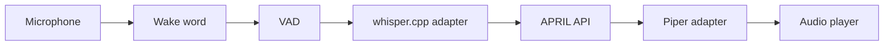

# Voice Design

Voice is optional and disabled by default.

Pipeline:

Rules:

- no downloads
- no microphone activation at API startup
- explicit CLI/service invocation only
- temporary audio under configured cache
- recordings removed by default
- fake STT/TTS are used in tests
